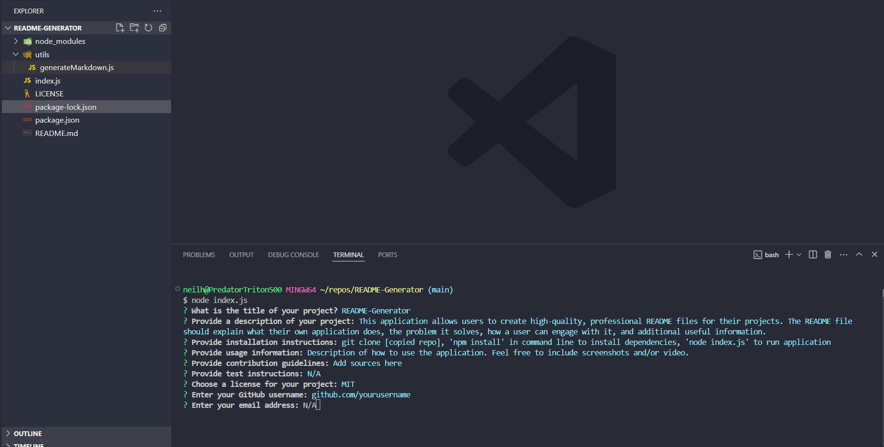

# README-Generator

## Description
This application allows users to create high-quality, professional README files for their projects. The README file should explain what their own application does, the problem it solves, how a user can engage with it, and additional useful information.

## Table of Contents
- [Installation](#installation)
- [Usage](#usage)
- [License](#license)
- [Contributing](#contributing)
- [Tests](#tests)
- [Questions](#questions)

## Installation
To get started, follow these steps:

1. Navigate to the [README-Generator GitHub repository](https://github.com/nhl1090/README-Generator)
2. Open Bash
3. Navigate to the folder where you would like to clone the repo
4. Use the following command to clone the repo to your local:
    'git clone https://github.com/nhl1090/README-Generator.git'
5. Open the cloned repo in VS Code
6. Use the following command to install the required dependencies:
    'npm install'
7. Use the following command to run the application:
        'node index.js'
8. Answer the questions and create your awesome, new README.md file!

## Usage

After we run 'node index.js', you will be prompted with the following questions:

To view a walkthrough video on how to run the application, see here:

## License
This project is licensed under the [MIT license](https://opensource.org/license/MIT).

## Contributing
- edX (https://www.edx.org/)
- GitHub; Full-Stack Blog (https://coding-boot-camp.github.io/full-stack/github/professional-readme-guide)
- GitHub; Microsoft (https://github.com/microsoft/vscode)
- MDN (https://developer.mozilla.org/en-US/)
- Mimo (https://mimo.org)
- Open Source Initiative (https://opensource.org/license/MIT)
- Stackoverflow (https://stackoverflow.com/)
- UT Coding Bootcamp GitLab site (https://git.bootcampcontent.com/University-of-Texas-at-Austin/UTA-VIRT-FSF-PT-05-2024-U-LOLC)
- W3 Schools (https://www.w3schools.com/)
- Wikipedia (https://en.wikipedia.org/wiki/Node.js)

## Tests
N/A

## Questions
For any questions, please reach out to me at [nhl1090](https://github.com/nhl1090). Thank you!